# PatchAlign-Cpp 架构与数据流

## 系统目标

PatchAlign-Cpp 把“局部代码修复模型”拆成可独立审计的四层：冻结数据、后训练、受约束生成、
真实执行评测。系统不以文本相似度判断正确性，也不让模型直接修改宿主仓库；最终判定来自隔离
环境中的补丁应用、编译和测试。

```mermaid
flowchart LR
    A[原始缺陷与测试] --> B[Schema 规范化]
    B --> C[family/split 去重与冻结]
    C --> D[SFT 数据]
    C --> E[train-only 候选生成]
    D --> F[M1-R2 SFT adapter]
    F --> E
    E --> G[Bubblewrap 执行评分]
    G --> H[chosen/rejected 偏好对]
    H --> I[DPO beta 对照训练]
    I --> J[独立 dev 选型]
    J --> K[唯一候选正式推理]
    K --> L[parse / policy / apply / build / tests]
    L --> M[配对指标、门禁与失败分析]
    M --> N[模型卡、CLI 与交付索引]
```



## 1. 数据与隔离层

- 样本统一为局部单文件修复任务，主任务为 function-level，并兼容 file-window 上下文。
- 训练、validation、开发选择、formal、confirmation 和 Defects4C 通过 case、problem family、
  repository family 等身份隔离。
- prompt 只包含 buggy code 和公开失败示例；fixed source、gold patch、hidden/regression tests 不进入
  模型输入。
- 数据、prompt、分母和顺序由 manifest 与 SHA256 冻结。生成失败和超时仍保留在固定分母中。

## 2. 后训练层

- Base 固定为 `Qwen/Qwen2.5-Coder-7B` revision
  `0396a76181e127dfc13e5c5ec48a8cee09938b02`。
- SFT 使用 NF4 QLoRA 学习严格 unified diff 输出；M1-R2 是 DPO 的冻结起点。
- train-only 样本经多候选生成和真实执行排序形成 chosen/rejected，执行结果本身不写入训练 prompt。
- DPO 只比较 `beta=0.1` 与 `beta=0.3`，使用独立 64 条 executable dev 集选择一次，不进行结果
  驱动的多轮搜索。

## 3. 生成与应用层

应用入口是 `patchalign-cpp` CLI。输入为一个 JSON 请求：

```json
{
  "task_level": "function",
  "allowed_path": "main.cpp",
  "buggy_code": "...",
  "public_test": {"input": "...", "output": "..."}
}
```

推理固定为 Base + LoRA adapter、NF4、greedy decoding、单返回序列和固定 token 上限。生成后执行：

1. 最多补一个传输层末尾 LF；
2. strict unified diff 解析；
3. 单文件和 `allowed_path` 策略校验；
4. 仅将通过校验的补丁交给后续沙箱。

CLI 不负责自动合并或提交补丁，生产仓库接入必须另加人工确认和权限边界。

## 4. 执行评分层

```text
raw model text
  → strict parse
  → path/policy check
  → git apply --recount --check
  → git apply --recount
  → isolated build
  → public tests
  → hidden tests
  → regression tests
  → sanitizer（仅显式适用样本）
```

Bubblewrap 运行时使用 rootless、禁网、最小挂载和超时限制。`--recount` 只忽略 diff 头中的行号
数字，不改写上下文或删改行；内容无法匹配时仍判 apply failure。每个样本保留终止阶段、返回码、
timeout 和必要的错误尾部。

## 5. 实验编排与证据层

- CPU preflight 先验证代码测试、模型、adapter、数据、prompt、环境和评分器身份。
- GPU 只用于训练与生成；编译和测试评分使用 CPU Slurm 作业。
- 长作业按样本或 segment 原子保存，依赖链通过 `afterok` 触发，失败不会静默进入下游。
- run manifest 绑定 Git commit、模型 revision、配置、数据、环境、预测和执行 artifact SHA256。
- 本机与集群用 Git 同步代码；大型数据、权重、预测和评分保留在集群，并将小型清单和摘要本地化。

## 6. 目录职责

| 目录 | 职责 |
|---|---|
| `src/patchalign/` | 可复用的补丁解析、门禁和应用推理代码 |
| `scripts/data/` | 数据资格、隔离、冻结和供给审计 |
| `scripts/training/` | SFT/DPO 训练、恢复和模型 artifact 校验 |
| `scripts/evaluation/` | DPO 选型、最终评测、聚合与失败分析 |
| `scripts/external/` | Defects4C 源码准备和 rootfs 执行 |
| `configs/` | 机器可读的冻结实验契约 |
| `schemas/` | 样本、预测、执行结果和运行清单 Schema |
| `slurm/` | 集群作业资源、环境和依赖入口 |
| `docs/decisions/` | 不静默改写的实验决策记录 |
| `docs/evidence/` | 作业、哈希、异常和结论证据 |
| `artifacts/` | Git 忽略的本地化/集群运行产物 |

## 边界

当前系统验证的是单文件、已定位、带公开失败示例的候选补丁生成，不是自主仓库级编码 Agent。
通过 parse、apply 或 compile 只表示漏斗前置阶段成功；只有 hidden 与 regression 全部通过才计为
Pass@1。任何最终质量描述必须引用冻结正式评测，而不能用训练 loss 或开发集选择结果替代。
